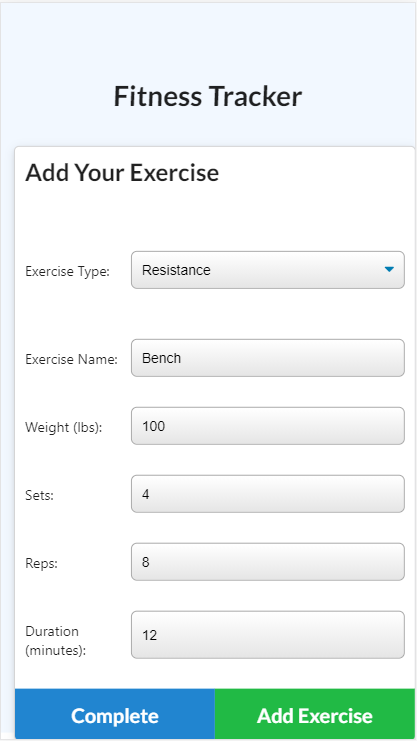

# Mongo-Fitt 
  

  ## Description ✏️
  
  Mongo-Fitt is a workout tracker that allows the user to create workouts and add multiple exercises.  There are two types of exercises to choose "Resistance" and "Cardio" these come with pre-select fields that the user enters data.   The app was created using MongoDB Atlas, Heroku and Mongoose along side Node.js.
  
  ## Table of Contents 📚
  
  * [Installation](#installation)
  * [Usage](#usage)
  * [License](#license)
  * [Contributing](#Contributing)
  * [Testing](#Testing)
  * [Questions](#Questions)
  
  ## Installation 

  ```
  📥 There is no installation required the user can access the app at mongo-fitt.herokuapp.com.  This application has been deployed on Heroku platform and utilizing MongoDB Atlas
  ```

  ## Usage 
  click [here@mongo-fitt](https://mongo-fitt.herokuapp.com/) app to gain access online.

  ```
  ▶️ The user will be presented with the homepage which if no workouts have previously been added will only show the choice of "New Workout".  The user can then add exercises with two main types being "Resistance" and "Cardio".   Once the user makes the initial type selection they will be presented with varying fields to fill out.  Resistance allows users to add Name, weight, sets, reps and duration && Cardio allows users to add Name, Distance and duration.  Once these fields have been filled out correctly the user can either chose to "Complete" the workout which means the user will add the current exercise and be redirected to the home page || if they choose "Add Exercises" the user will be able to add another exercise to the workout.  Once workouts have been added a summary of the last workout will appear on the homepage and the user can also so see stats in graphical display by clicking the dashboard link.  Here stats are shown in bar and pie charts of the history of workouts that have been saved. 
  ```
  

  ## License 
  
  📜 License Code: MIT

  For detailed information on license [Click Here](https://opensource.org/licenses/MIT)
  
  ## Contributing
  
  👌 Not currently taking aby contributions
  
  ## Testing 

  ```
  ✔️ No tests have been included in the development of this app
  ```

  ## Questions 
  
  Direct questions to me via email 📧 at [tmoschos@bigpond.com](tmoschos@bigpond.com).  Please use "Mongo-Fitt questions" in the subject and I will hopefully return a response within 48hrs.

  More information can be found at my [GitHub Profile](https://github.com/EMoschos).
  
---
This README was created by the "Great-Read" 📝 Node.js app.  Developed by Eleftherios Moschos
